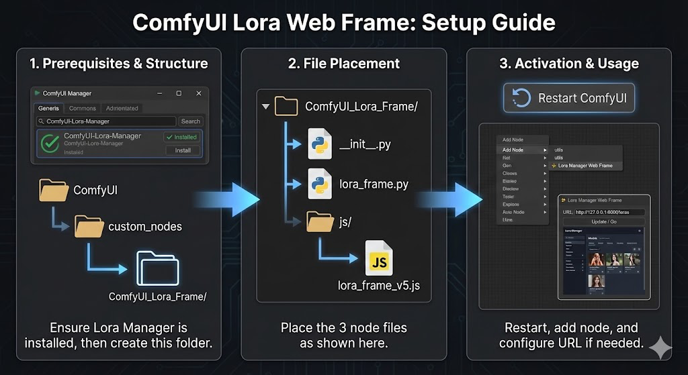

# ✨ ComfyUI Lora Manager Web Frame



A simple custom node that embeds the full [ComfyUI-Lora-Manager](https://github.com/willmiao/ComfyUI-Lora-Manager) web interface directly into your ComfyUI workflow graph. This eliminates the need to have a separate browser tab open for managing your LoRAs and recipes.

## Prerequisites

This node is a wrapper and requires the original extension to be installed and active.

1. Install ComfyUI-Lora-Manager: Use ComfyUI Manager or install manually from [willmiao/ComfyUI-Lora-Manager](https://github.com/willmiao/ComfyUI-Lora-Manager).
2. Verify it works: Ensure you can access the manager in your browser before using this node.

## Installation

### Option 1: Via ComfyUI Manager (Recommended)
1. Open ComfyUI Manager
2. Search for "Lora Manager Web Frame"
3. Click Install
4. Restart ComfyUI

### Option 2: Manual Installation from ZIP
1. Download the repository as a ZIP file from GitHub
2. Extract the ZIP file
3. Rename the extracted folder from `LoraMangerWebFrame-main` to `LoraMangerWebFrame`
4. Move the renamed folder to your ComfyUI `custom_nodes` directory:
   ```
   ComfyUI/custom_nodes/LoraMangerWebFrame/
   ```
5. Restart ComfyUI

### Option 3: Git Clone
```bash
cd ComfyUI/custom_nodes
git clone https://github.com/revisiontony/LoraMangerWebFrame.git
```

## Usage

1. Add the "✨ Lora Manager Web Frame" node to your workflow.
2. The node will display the embedded Lora Manager interface.
3. **Smart Discovery:** The node will automatically attempt to find your Lora Manager server on startup.

### Smart Port Discovery

The web frame now features a robust, multi-strategy discovery engine to find your Lora Manager, even if its port changes (common in ComfyUI desktop or multi-instance setups):

1. **Origin Match:** It first checks your current ComfyUI address (the same logic as the Lora Manager's own launch button).
2. **Server-Side Scan:** If the first step fails, the backend will scan ports 8000-8005 to find the active service, bypassing browser CORS restrictions.
3. **Manual Port Scan:** Click the **Port Scan** button at any time to trigger a fresh discovery.

### Changing the Address Manually

If you need to point the node to a specific or remote address:
1. **Edit:** Click the text input field at the top of the node and type in your specific address (e.g., `http://192.168.1.10:8188/loras`).
2. **Persistence:** The node automatically saves your custom URL within the workflow (Ctrl+S).

## Example Workflows

Check out the example workflow files included in the repository to see the node in action.

## Contributing

See [CONTRIBUTING.md](CONTRIBUTING.md) for guidelines.

---

## Changelog

### [Unreleased]
#### Added
- **Multi-strategy port discovery:**
    - **Strategy 1:** Checks the current window origin (matches Lora Manager launch button behavior).
    - **Strategy 2:** Smarter server-side scanning including active ComfyUI port/host.
    - **Strategy 3:** Enhanced client-side brute force fallback.
- **Support for varied hostnames:** Compatible with `127.0.0.1`, `localhost`, and custom remote hosts.
- **Verification logic:** Ensures the found port is actually hosting Lora Manager by checking page content.
- **Force reload:** Implementation of a hard refresh (via `about:blank`) when ports are rediscovered.
- **Port Scan Button:** Replaced "Update / Go" with a more powerful discovery trigger.
- **Startup Automation:** Proactively finds the correct port as soon as the node is created.

#### Changed
- Improved startup reliability with proactive port discovery.
- Updated UI to reflect new discovery capabilities.
